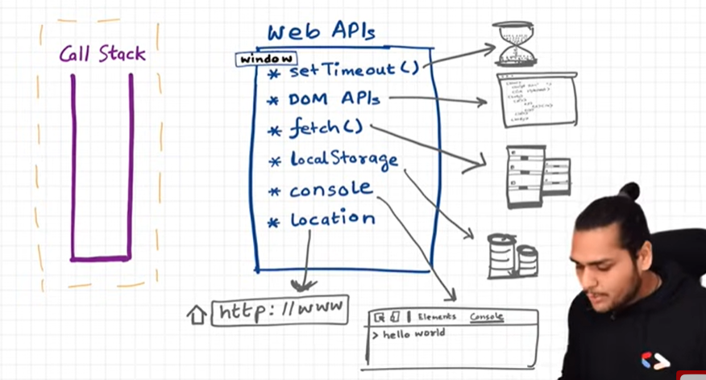

# JS Tutorial (Namaste)

## How Js Works and what is execution context?

-->

1. Everything in js happens in Execution Context.
   
2. JS is synchronous single threaded language.
   --> Js is only executed 1 command at a time in a specific order.

## What happens when you run javascript code ?

--> While execution of js code it goes through 2 phases:
a. Memory creation Phase
b. Code Execution Phase

1. In the first phase the global execution context is created and
   all the varibles and function are allocated with some memory in memory block. varibles are initialize with "undefine" whereas function's whole code is pasted.

2. In code execution phase var are initialized with its value and when some function is inovked then again "Execution context " is created for that function(Mini program). [when done function execution context deleted]


Now, How js handle all of this ?
--> Handles with Call stack


## Hoisting in Js ?

--> Hoisting is the default behavior of moving all the declarations at the top of the scope before code execution
-->Hositing is phenonmemon in js with which we can access variable and function (anywhere in program) even before its initialization without any error.

Note: Arrow function is behave just like a varible so in the 1st phase it is initialize with "undefine".

## How function work in js and variable environment?

[ Same as previous thing..]

1.  console.log(x) in this Js runtime environments try to find x from
    local space.

2.  See in the browser...

## Shortest Js program -- window and this keyword

1. Whenever we run the js code in JRE (In browser , whatever place) it does 2 things create a global execution context , Global object in case of browser it is windows and this keyword initially it is pointing towards windows.
2. this === windows (initially)
3. Even though our file is empty "1" will always happen.
4. whatever we declare in global space attach with windows.

## Undefine and Not define

1. Undefine : memory is allocated but not initiallized with value.
2. Not define : memory not allocated that varible.

Note : Js is loosely(weakly) typed language : It doesn't attach its varibale to specific type of data type if x = "Abhi" then i can assign x =10 later.

3. It is not a good practise to put undefined in any varible

## Scope Chain , Scope and Lexical Environment

1. Scope : from where u can access the varible.

2. Lexical Environment: (Created when execution context is created)
   1. Lexical : (hierarchy)
   2. Lexical environment means local memory space + reference to parent's lexical environment.

ex: script2.js
Way of finding the variable from the local space --> parent lexical environment --> parent's parent lexical environ ==> this k/as scope chain.


## Let & const in js and Temporal Dead Zone

Notes :
a. In case of let and const the variable memory is allocated in different memory space i.e in script.
b. It can not be access before initialization.

1. What is a Temporal Dead Zone?
   --> time between the let variable is hoisted and it is initialize.
   b. this error also occur to variable which is not there in program.

2. Are let and const declarations hoisted?
   --> let & const declarations are hoisted but in different ways.

3. SyntaxError vs ReferenceError and TypeError

---> Whenever try to access the variable during temporal dead zone period then it will throw this " ReferenceError".

---> We can redeclare "var" but can not redeclare "let" it will throw "SyntaxError" if we try to do so.

---> const is more strict than let it should initialize when it declare.

---> When we reassign the const variable then it throws "TypeError".

whenever u can use const >> let >> var.

Notes :
Things learned:

1. let and const are hoisted but its memory is allocated at other place than window which cannot be accessed before initialisation.
2. Temporal Dead Zone exists until variable is declared and assigned a value.
3. window.variable OR this.variable will not give value of variable defined using let or const.
4. We cannot redeclare the same variable with let/const(even with using var the second time).
5. const variable declaration and initialisation must be done on the same line.
6. There are three types of error: [1] referenceError {given where variable does not have memory allocation} [2] typeError {given when we change type that is not supposed to be changed} [3] syntaxError {when proper syntax(way of writing a statement) is not used}.
7. Use const wherever possible followed by let, Use var as little as possible(only if you have to). It helps avoid error.
8. Initialising variables at the top is good idea, helps shrinks TDZ to zero.

Practise: In script2.js

## Block , Scope and Shadowing

### What is block in js ?

--> Block is helps to combine multiple statements so we can use it where js expects the single statements. [Compound Statement]

### What is block scope ?

--> What all variable and function we can access in the block.
let and const varible allocated the memory in the block and when that block is no longer needed then let and const are freed up. therefore let and const are block scope. and var can be access .

Note : "var" is function scoped
ex: script2.js

### What is shadowing ?

--> If we declare "var" in 1 place and then we redeclare the same "var" again then next "var" will shadow the previous one.
--> let/const also can be shadowed but both global and local let/const will have different scope.

### What is illegal Shadowing?

--> ex :

<!-- let a = 20;
{
 var a = 30;
} -->   can not shadow like this

<!-- var a = 20;
{
let a = 30;
} ---> can do this  -->

<!-- let a = 20;
function x(){
var a = 30;
} --> can do this also -- same for const

<!-- Scope rule for arrow function and normal function will be same -->

## Closures in Js

--> A closure is the combination of a function bundled together (enclosed) with references to its surrounding state (the lexical environment). In other words, a closure gives you access to an outer function's scope from an inner function. In JavaScript, closures are created every time a function is created, at function creation time.
In js we can pass function as parameter to another function, we can return it also , we assign it to other variable also .

---> Function along with its lexical bundles forms a closure.

### When u return the function via another function then what does it mean?

--->

<!-- function x(){
   var c =10
   function y(){
      console.log(c);
   }
   c = 20;
   return y;
} -->  what it means?

const z = x();
z();

--> When y is return then the {function y() + lexical scope} ==> closure was return.
ex: script2.js

#### Uses of Closures:

- Module Design Pattern
- Currying (can check it)
- Functions like once
- memoize
- Maintaining state in async world
- setTimeouts
- Iterators
- and many more...

## SetTimeout | Closures Interview Questions

How setTimeout works ?
--> setTime store the call back function somewhere till the timeout time passed and that function rember its lexical enviornment and after timeout is over it put on to call stack and execute it.

Things learned:

1. setTimeout stores the function in a different place and attached a timer to it, when the timer is finished it rejoins the call stack and executed.
2. Without closure the var reference gives the latest value as it does not retain the original value but rather has the reference so any update in value after timeout will be shown.
3. If we use let/const because they have block scope, every time a new copy of variable is attached, thus this can be done without closure.

<!-- Crazy Js Interview  -->

1.  FunctionName()() --> if this function is returing some other function this will call to the returned function.

2.  Advantages of Closure:(usecase)
    a. Can be use in function curry
    b. high order function like memoize, once.
    c. it helps in data hiding and encapsulation. ex: script2.js

3.  Constructor function :

    1. Function in which we use "this" keyword so to invoke that function we have to use "new" keyword.
    2. In JavaScript, constructor functions are a way to create objects with a shared set of properties and methods. They are typically used when you need to create multiple instances of objects with similar characteristics. Constructor functions are invoked using the new keyword.

    To provide same characterestic and features to multiple instances there is constructor function now there is classes also there.

    // Constructor function for creating Person objects
    function Person(name, age) {
    // Properties
    this.name = name;
    this.age = age;

        // Method
        this.sayHello = function() {
            console.log(`Hello, my name is ${this.name} and I am ${this.age} years old.`);
        };

    }

<!-- class Person {
constructor(name, age) {
this.name = name;
this.age = age;
}

    sayHello() {
        console.log(`Hello, my name is ${this.name} and I am ${this.age} years old.`);
    }

} -->

### What it means by scable code ?

The term "scalable" in the context of code refers to the ability of the codebase to handle growth and increased complexity without a proportional increase in difficulty. Scalable code is designed and structured in a way that makes it easy to maintain, extend, and adapt as the application or project evolves.

<!--
Here are some key aspects of scalable code:

1. **Readability:**
   - Code should be easy to read and understand. Well-named variables and functions, clear comments, and a consistent coding style contribute to readability.

2. **Modularity:**
   - Code should be organized into modular components or functions. This allows for better code reuse and makes it easier to understand the different parts of the system.

3. **Maintainability:**
   - Scalable code is maintainable over time. It should be easy to fix bugs, add new features, and make changes without causing unintended side effects.

4. **Flexibility:**
   - Code should be flexible and adaptable to changing requirements. This might involve using design patterns, avoiding hard-coded values, and providing configuration options.

5. **Scalability in Performance:**
   - In a broader sense, scalable code can also refer to the performance scalability of an application. This involves designing the system in a way that allows it to handle increased load or larger datasets efficiently.

6. **Avoiding Code Duplication:**
   - Repeated code, also known as code duplication, makes the codebase harder to maintain. Scalable code minimizes duplication through the use of functions, modules, and libraries.

7. **Testing:**
   - Scalable code includes a comprehensive testing strategy. Automated tests ensure that changes to the codebase don't introduce new issues and provide confidence in the code's correctness.

8. **Documentation:**
   - Well-documented code helps developers understand how different components work and how they interact. This is especially important for teams where multiple developers may work on the same codebase.

9. **Adherence to Best Practices:**
   - Following industry best practices and coding standards ensures consistency and makes it easier for developers to work collaboratively on a project.

10. **Performance Optimization:**
    - Scalable code may include optimizations for performance, such as minimizing unnecessary computations, using efficient algorithms, and optimizing database queries.

In summary, scalable code is about creating a codebase that can grow and evolve over time without becoming overly complex or difficult to maintain. It involves a combination of good design principles, coding practices, and a focus on readability and maintainability. -->

3. Disadvantage of closure:
   a. Overconsumption of memory because those variable are not garabage collected.
   b. It can also leak the memory if not handle properly and freeze the browser.

4. What is garbage collector ?
   --> 1. Garbage collector is a program in Js Engine take care of unused variable by freeing it.
5. What is relationship between garbage collector and closures ?
   --> 1. Some of the new browser like Chrome V8 Engine smartly collect the varibles inside closure. 2. What does it mean smartly collect ?
   --> if some variable is not used in inner function then it garbage collected by browser.

### First Class Function & Anonymous Functions (Function without name)

ex: script3.js

### Callback functions in event Listeners

// Js is a synchronous and single-threaded lanaguage

// Blocking the main thread

// Power of Callbacks?
// Deep about Event Listners
// Closures Demo with Event Listners
// Scope Demo with Event Listners
// Garbage Collection and removeEventListners

ex: script3.js

1. Everything is executed through the 1 call stack also k/as main thread of javascript
   let say some function operation take so much time to execute so it can block our call stack i.e k/as
   blocking the main thread.

2. How event loop looks inside devtools ex: script3.js

3. Garbage Collections and Remove Event Listner
   --> Why it needed because it can be heavy (event listner) it is not present
   in call stack all the time but still it occupy the memory so when it is no longer needed we should remove it inorder to make our webpage lightweight.

### Asynchronous Javascript and Event Loop from Scratch




microtask queue : [promises and mutationObserver ] -- The MutationObserver interface provides the ability to watch for changes being made to the DOM tree.
Things learned:

<!-- To prevent callback starvation, it is important to minimize the number of synchronous operations and avoid long-running tasks.
Asynchronous code should be used whenever possible, and the use of promises or async/await
can help simplify asynchronous code and reduce the number of callbacks. -->

1. Browser has superpowers that are lent to JS engine to execute some tasks, these superpowers include web API's such as console, location, DOM API, setTimeout, fetch, local storage.
2. Callback functions and event handers are first stored in Web API environment and then transferred to callback queue.
3. Promises and mutation observer are stored in API environment and then transferred to microtask queue.
4. Event loop continuously observes call stack and when it is empty it transfers task from callback queue/Microtask queue to call stack.
5. Micro task is given priority over callback tasks.
6. Too many micro tasks generated can cause Starvation (nit giving time to callback tasks to execute).

Some Questions :

1. Why there is need of callback Queue?
   --> The callback queue helps maintain the order of execution for asynchronous operations.
2. How we handle the starvation of task present in callback queue as microtask queue has higher priority ?
   ---> Read about it

3. When does the event loop actually start?
   ---> Event loop, as the name suggests, is a single-thread, loop that is `almost infinite`. It's always running and doing its job. ❤️
4. Are only asynchronous web API callbacks are registered in the web API environment?
   ---> YES, the synchronous callback functions like what we pass inside map, filter, and reduce aren't registered in the Web API environment. It's just those async callback functions that go through all this.
5. Does the web API environment stores only the callback function and pushes the same callback to queue/microtask queue?
   --> Yes, the callback functions are stored, and a reference is scheduled in the queues. Moreover, in the case of event listeners(for example click handlers), the original callbacks stay in the web API environment forever, that's why it's advised to explicitly remove the listeners when not in use so that the garbage collector does its job.
6. How does it matter if we delay for setTimeout would be 0ms. Then callback will move to queue without any wait?
   --> Answer will get in future

### JS Engine and Google's V8 Architecture

#### Structure of JS Runtime Enivornment

JS Runtime Enivorment is like a container.


1. Js can run anywhere only thing needed is JS Runtime Enivornment
2. This enivorment different in device to device like in browser it could be different than nodejs .

JS Engine :

1. Js ENGINE is not a machine , it is just a software.
   Internal Dia of JS Engine:
   

   a. Parsing :
   In parsing 2 things happen a. tokenization and then it does SyntaxParsing (Create AST-Abstract Syntax Tree).
   [AST](https://astexplorer.net/)

   b. Comilation:
   It takes AST then it does JIT -(Just in time compilation) there are diff algo depend on browswer to browser and it gives ByteCode.

   c. Execution : there are 2 major components [ memory heap(store variable) and Callstack]
   here GC(garbage collector) there which free up the unused. it use
   mark and sweep algorithm[Read about it].
   

   TOREAD : [Optimization Techinque]

   1. Mark and sweep
   2. Inlining
   3. Copy elision
   4. Inline Caching

2. is JS interpretted or compiled langauage ? --> Depends upon JS engine
   modern browser use both.
3. JS is Just in time compile langauage.

### Google V8 Engine [Fastest Js engine]


### Trust Issues with setTimeOut() :

<!-- Concurrency Model Working All that we studied how callback is executed -->


ex: script4.js

Why there is only 1 callstack in js?
--> 1. Because it has it own advantages it runs our code quickly we don't have to wait much more to load our page.(Interpreted language)

### Functional Programming - (Higher Order of Functions)

What is higher order functions?
--> Function which takes func as a parameter or return the function.

ex: script4.js [Modular Code]

1.DRY Principle : Don't repeat yourself
2.Reuseablity
3.Modularity

## Prototype and Prototypal Inheritance in JS (Core JS)

ex. [script5.js](/Codes/script5.js)

1. Everything in js is an object.

### Map , Filter and Reduce

// Use

Home work :

Solve using reduce : Print the first name of user which age is less than 30
const users = [
{firstName:"Abhishek",lastName:"Ikhar",age:21},
{firstName:"Hrushabh",lastName:"Jadhav",age:22},
{firstName:"Atharv",lastName:"Ikhar",age:17},
{firstName:"Rohit",lastName:"Jadhav",age:21},
]

// TODO : Polyfills of map, reduce and filter -- Done

<!-- const cart = []

output = cart.reduce((acc,curr)=>{
   if(curr.age<30){
      acc.push(curr.firstName);
   }
   return acc;
},[]) -->

ex: script5.js []

### Problems with callback

### Callback Hell:

Advantages of Callback

1.  To do Asynchronous operation we need callback function.
2.  In Ecommerce website we need to have asychronous operation because after create order --> payment --> order summary -> update_Wallet is there.
    Issues with Callback:

3.  Callback Hell :
    When there lots of dependent apis then we fall into callback hell
    ex:

    ```
    const cart = ["Shoes","Pants","Kurtas"];

    api.createOrder(cart,function(){
      api.createToPayment(function (){
         api.showOrderSummary{
            function (){
               api.updateWallet();
            }
         }
      })
    })
    ```

    Unreadable and Unmaintaintable. : (Pyramid of Doom)

4.  Inversion of Control : We loose our control over the code because we give our function to other function now it depend on other function to get call .

### Promise Creation , Chaining and Error Handling

00:00 - Introduction
01:05 - Consuming Promises
02:56 - Creating a Promise
15:23 - Promise Rejection
16:21 - Error Handling
18:17 - Promise Chaining
22:33 - Advanced Promise Chaining
26:28 - Advanced Error Handling
32:24 - Recap of the video
35:35 - Teaser of the Next Video
36:10 - Homework for this episode

### Async-Await

00:00 - Introduction
01:08 - What is async in JS
15:15 - Using Await with async
21:48 - Diving deep into async/await
40:43 - Behind the scenes of async await
55:09 - Real world examples
01:04: 28 - Error Handling
01:09:00 - interview Tips
01:11:03 - async await vs promise then/catch

1. What is async ?
   --> Async function always return a promise. Either in async function u return a promise or u return value then this function will wrap ur values inside the promise and return it.

2. What is await ?
   --> Async-Await is use to handle promises. Await can only use inside async function.

3. How do we handle promises before Asyn-await ?
   -->

4. but why it is needed , what is there before it ?
   -->

### Error Handling

For the error handling use try-catch block wherever u did the API calls

### Interview Tips

1. What is Async-await ?
   --> Async is a keyword which is use with function and that function calls as Asynchronous Function.

### Async-await and Promise.then/Catch

Async-await is just a syntatically sugar and it is better way to handle promises.

### JS HTML DOM [DOM]

When a web page is loaded, the browser creates a Document Object Model of the page.
With the object model, JavaScript gets all the power it needs to create dynamic HTML:

The DOM is a W3C (World Wide Web Consortium) standard.

The DOM defines a standard for accessing documents:

"The W3C Document Object Model (DOM) is a platform and language-neutral interface that allows programs and scripts to dynamically access and update the content, structure, and style of a document."

The W3C DOM standard is separated into 3 different parts:

Core DOM - standard model for all document types
XML DOM - standard model for XML documents
HTML DOM - standard model for HTML documents

NOTE: The HTML DOM is a standard object model and programming interface for HTML.

1. In the DOM, all HTML elements are defined as objects.
2. A property is a value that u can set or get.
3. A method is action u can do.

## Finding HTML Elements

### Method Description

    document.getElementById(id) Find an element by element id
    document.getElementsByTagName(name) Find elements by tag name
    document.getElementsByClassName(name) Find elements by class name
    Changing HTML Elements

### Property Description

    element.innerHTML = new html content Change the inner HTML of an element
    element.attribute = new value Change the attribute value of an HTML element
    element.style.property = new style Change the style of an HTML element

    Method Description
    element.setAttribute(attribute, value) Change the attribute value of an HTML element

### Adding and Deleting Elements

    Method Description
    document.createElement(element) Create an HTML element
    document.removeChild(element) Remove an HTML element
    document.appendChild(element) Add an HTML element
    document.replaceChild(new, old) Replace an HTML element
    document.write(text) Write into the HTML output stream

### Adding Events Handlers

    Method Description
    document.getElementById(id).onclick = function(){code} Adding event     handler code to an onclick event
